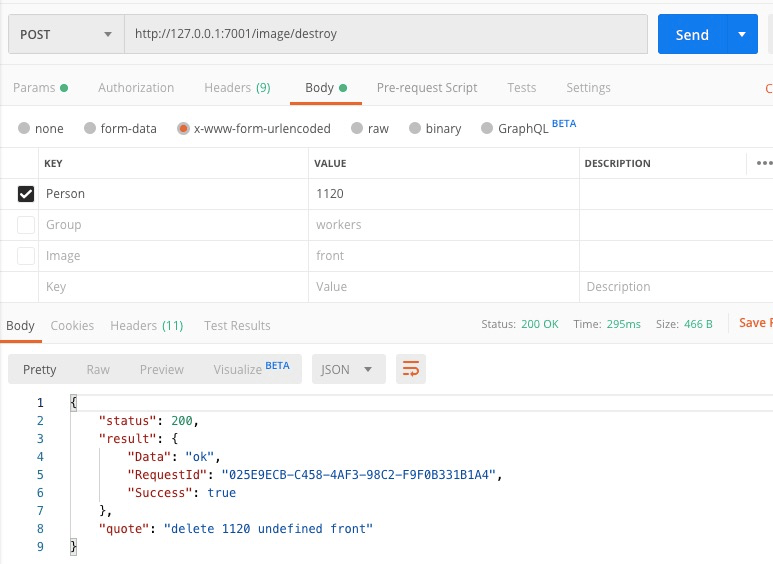

# projector
Face detect and IOT data display, use for face recognized and return their info to display.

[The brief introduction of optional stroke](https://www.yuque.com/abs/homework/pt8mz7)

## TechStack 
- antdesign pro
- face api
- g2 for plot
- emitter for pubsub
- aliyun face node sdk 
- eggjs for backserver
- mysql for user info 
- go fileserver for file host
- sequelize with eggjs for mysql data model 

## Face Usage


- use own aliyun [face api](https://help.aliyun.com/document_detail/118565.html?spm=a2c4g.11186623.6.558.581f5a17vK1cli#h2-deleteface5) apikey

- run emitter and mysql in [face/mysql&emitter](https://github.com/yhyddr/projector/blob/master/face/mysql%26emitter/README.md)

- run face api model file host in weights
```bash
cd weights && go run file.go
```

- run frontend 
```bash
cd  face/frontend 
npm install
npm start
```

- run backend 
mysql database [with egg js](https://eggjs.org/zh-cn/tutorials/sequelize.html)

create two database with `egg-sequelize-doc-default` `egg-sequelize-doc-unittest` 
feel free to find related file in face/sequelize/database and face/sequelize/app/model and change it when you need update user info model in mysql
use `npm install --save-dev sequelize-cli` to install sequelize
```bash
# 升级数据库
npx sequelize db:migrate
# 如果有问题需要回滚，可以通过 `db:migrate:undo` 回退一个变更
# npx sequelize db:migrate:undo
# 可以通过 `db:migrate:undo:all` 回退到初始状态
# npx sequelize db:migrate:undo:all
```
--- 

```
cd face/sequelize 
npm install
npm run dev
```

- run fileserver to have image display.
```bash
cd face/fileserver
go run fileserver.go
```

### Config with face detect
at top of [face/sequelize/app/controller/image.js](https://github.com/yhyddr/projector/blob/master/face/sequelize/app/controller/image.js)


### Image API




### User API
User use resultful api.


## Dashboard Usage


- run frontend 
```bash
cd  dashboard/frontend 
npm install
npm start
```
- change the data
```
http://localhost:8000/submit
```

- display the data
```
http://localhost:8000/dashboardmonitor
```

```bash
# we can run this project in localhost
```

## TechStack 
- UmiJS for umi create
- npm / cnpm for bag control
- emitter for date transmission
- Localstorage 
- Ant Design Pro for page design
- GitHub for components
